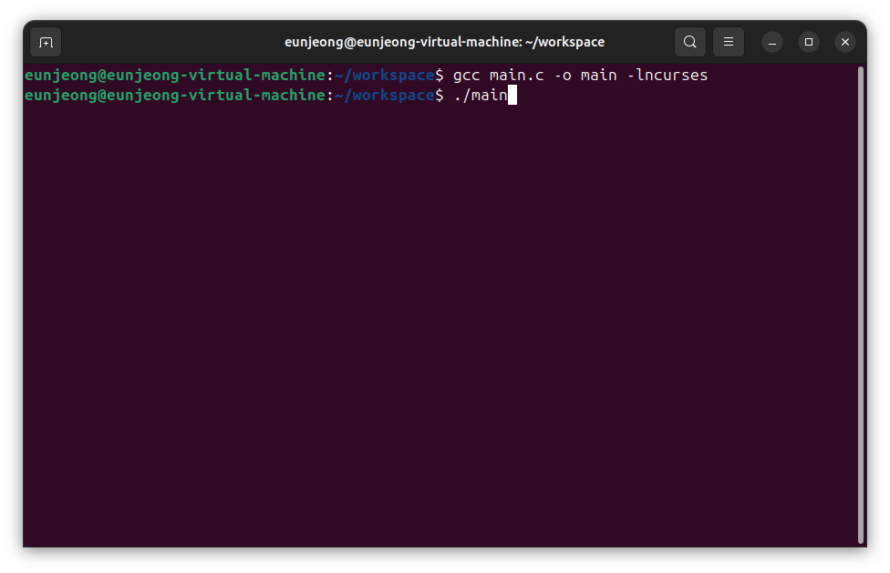

# 2024 동계 자율 프로젝트

## 💡 주제 : ** Linux 파일 통합 관리 시스템**

### 💭 배경 및 목적
>  리눅스 환경에서 파일 관리는 필수적인 작업으로, 다양한 명령어들이 파일 탐색, 처리, 관리 등에 사용됩니다. 하지만 이러한 명령어들은 각각 분리되어 사용되기 때문에 사용자가 기억하기 어렵거나 전체적인 파일 관리 흐름을 파악하기 힘듭니다.  
>
> 이에 지난 학기동안 시스템 프로그래밍 수업 시간에 몇 가지 리눅스 명령어를 직접 구현해보며 약간의 흥미를 느꼈는데, 이 흥미를 가지고 추가적인 명령어들을 더 구현하여 하나의 프로그램으로 통합해보고 싶어 이 프로젝트를 진행하고자 합니다. 

---

### ✨ 기능

- 리눅스 파일 처리 명령어 구현 및 통합(cp, mv, rm, chmod)
- 동작 과정 및 출력 결과 제공: 각 명령어 실행 시 내부 동작 과정과 출력 결과를 터미널에 출력
- 통합된 UI/CLI 제공: 명령어를 사용자가 선택 및 실행할 수 있는 통합 CLI를 구현 예정

### 🖥️ 통합 개발 환경

- 프로그래밍 언어: C
- 운영 체제: Linux
- IDE: visual studio code
- 라이브러리: <stdio.h>, <stdlib.h>, <sys/stat.h>, <dirent.h>, <string.h>, <pwd.h>, <grp.h>, <time.h>, <curses.h>, <fcntl.h>, <unistd.h>

---

### 🗓️ 프로젝트 과정

- 1주차: 프로젝트 구상, 세부 기능 명세서 작성
- 2주차: 방향키로 디렉토리를 선택할 수 있는 ls 명령어 구현
- 3주차: cp, mv, rm, chmod 명령어 구현
- 4주차: 명령어 통합 및 UI 개선

---

### 💭 동작 과정

1. ls 명령어를 구현해서 현재 디렉토리 내의 파일 및 디렉토리들을 보여줌
2. <curses.h>를 이용하여 터미널에서 방향키로 파일 또는 디렉토리를 선택할 수 있게 함
    1. 디렉토리 선택 시, 해당 디렉토리로 들어가서 이 과정 계속 반복
    2. 파일 선택 시, 다음 단계 수행
3. 작업할 파일을 선택하고 난 후, 수행할 명령어를 입력 받음
4. 입력 받은 명령어를 해당 파일에 대해 수행하고, 다시 돌아갈 것인지 이 프로그램을 종료할 것인지 표준 입력으로 받음
    1. 명령어들은 각각의 함수로 구현

---

### 💻 수행 과정

1. 컴파일
    
    
    
2. 디렉토리 선택
    
    
    
3. 파일 선택
    
    
    
4. 명령어 메뉴
    
    
    
5. 명령어 1. cp(copy)
    1. 명령어 선택
        
        
        
    2. 복사할 파일을 저장할 경로 선택
        
        
        
    3. 결과
        
        
        
6. 명령어 2. mv(move)
    1. 명령어 선택
        
        
        
    2. 결과
        
        
        
7. 명령어 4. chmod(change mode)
    1. 명령어 선택
        
        
        
    2. 결과
        
        
        
8. 명령어 3. rm(remove)
    1. 명령어 선택
        
        
        
    2. 결과
        
        
        
9. 전체 터미널
    
    
